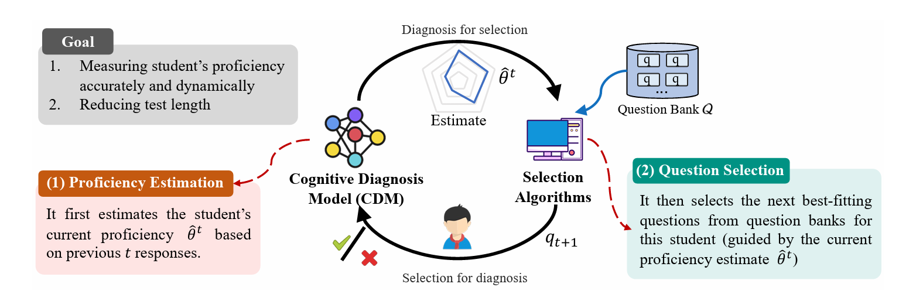

# Computerized Adaptive Testing: A Python Library
<!-- **<font size=5>Computerized Adaptive Testing Package, including the following models and strategies.</font>** -->
This Python library offers a streamlined solution for rapidly developing a Computerized Adaptive Testing (CAT) system. It encompasses a comprehensive suite of tools that integrate both traditional statistical methods and recent machine learning and deep learning techniques.

[](https://pypi.org/project/EduCAT/)
[](https://github.com/bigdata-ustc/EduCAT/blob/main/LICENSE)  

## ❗ What is CAT About?

**Computerized Adaptive Testing (CAT)** stands as one of the earliest and most successful integrations of educational practices and computing technology.  
CAT is a dynamic and interactive process between a student and a testing system. If traditional paper-and-pencil tests are "one-for-all," then CAT is "one-for-each". Each student gets a personalized test that adapts to their proficiency level and knowledge, ensuring each question accurately assesses and challenges them. CAT tailors the selection of questions to each student’s level of proficiency, thereby maximizing the accuracy of the assessment while minimizing the test length. 


The CAT system is split into two main components that take turns: At each test step, the Cognitive Diagnosis Model (CDM), as the user model, first uses the student’s previous  responses to estimate their current proficiency, based on cognitive science or psychometrics. Then, the Selection Algorithm picks the next question from the bank according to certain criteria.This two-step process repeats until a predefined stopping rule is met, and the final estimated proficiency (i.e., diagnostic report) of individual students will be fed back to themselves as the outcome of this assessment or for facilitating future learning. 




## ⚡ Contribution

This repository implements basic functionalities of CAT. It includes the implements three types of CDM: Item Response Theory, Multidimensional Item Response Theory and Neural Cognitive Diagnosis. And each CDM has its corresponding selection algorithm:
* **<font size=4>[IRT](https://link.springer.com/book/10.1007/978-0-387-89976-3): Item Response Theory**</font>
  * [<u>MFI</u>](https://api.taylorfrancis.com/content/books/mono/download?identifierName=doi&identifierValue=10.4324/9780203056615&type=googlepdf): Maximum Fisher Information strategy
  * [<u>KLI</u>](https://journals.sagepub.com/doi/abs/10.1177/014662169602000303): Kullback-Leibler Information strategy
  * [<u>MAAT</u>](https://ieeexplore.ieee.org/abstract/document/9338437/): Model-Agnostic Adaptive Testing strategy
  * [<u>BECAT</u>](https://nips.cc/virtual/2023/poster/70224): Bounded Ability Estimation Adaptive Testing strategy 
  * [<u>BOBCAT</u>](https://www.ijcai.org/proceedings/2021/0332.pdf): Bilevel Optimization-Based Computerized Adaptive Testing strategy 
  * [<u>NCAT</u>](https://ojs.aaai.org/index.php/AAAI/article/view/20399): Neural Computerized Adaptive Testing strategy 
* **<font size=4>[MIRT](https://link.springer.com/book/10.1007/978-0-387-89976-3): Multidimensional Item Response Theory</font>**
  * [<u>D-opt</u>](https://www.sciencedirect.com/science/article/pii/S0169716106260188): D-Optimality strategy
  * [<u>MKLI</u>](https://link.springer.com/article/10.1007/s11336-014-9401-5): Multivariate Kullback-Leibler Information strategy
  * [<u>MAAT</u>](https://ieeexplore.ieee.org/abstract/document/9338437/): Model-Agnostic Adaptive Testing strategy
  * [<u>BOBCAT</u>](https://www.ijcai.org/proceedings/2021/0332.pdf): Bilevel Optimization-Based Computerized Adaptive Testing strategy 
  * [<u>NCAT</u>](https://ojs.aaai.org/index.php/AAAI/article/view/20399): Neural Computerized Adaptive Testing strategy 
* **<font size=4>[NCD](https://ojs.aaai.org/index.php/AAAI/article/view/6080): Neural Cognitive Diagnosis</font>**
  * [<u>MAAT</u>](https://ieeexplore.ieee.org/abstract/document/9338437/): Model-Agnostic Adaptive Testing strategy
  * [<u>BECAT</u>](https://nips.cc/virtual/2023/poster/70224): Bounded Ability Estimation Adaptive Testing strategy 

<!-- BECAT strategy comes from paper A Bounded Ability Estimation for Computerized Adaptive Testing [Paper](https://nips.cc/virtual/2023/poster/70224) -->

It is worth noting that the data needs to be processed before it can be used. In the script/dataset directory, we provide the preprocessing files for the ASSISTment dataset for reference.

## ⚡ Installation

To make use of our work, you should do these below:

Git and install by `pip`

```
pip install -e .
```
or install from `pypi`
```
pip install EduCAT
```

## Quick Start

See the examples in `scripts` directory.

## utils

### Visualization

By default, we use `tensorboard` to help visualize the reward of each iteration, see demos in `scripts` and use

```
tensorboard --logdir /path/to/logs
```

to see the visualization result.


## 📕 Machine Learning-Based Methods
### 🔍Cognitive Diagnosis Models (CDM)
Cognitive Diagnosis Model (CDM), as the user model, first uses the student's previous responses to estimate their current proficiency, based on cognitive science or psychometrics.

<!-- Item Response Theory (IRT) is a statistical model used to assess individual abilities and traits. students’ proficiencies and question difficulties are handled as overall attributes reflected in students’ historical response data. These attributes can be single or multidimensional and are estimated through latent parameter estimation techniques. 


#### Neural Cognitive Diagnosis (NCD)
Neural Cognitive Diagnosis (NCD) is a cutting-edge framework designed to tackle the challenges inherent in cognitive diagnosis, in response to the complex and non-linear interactions between students and questions. In NCD models, we project students and questions to factor vectors and incorporates neural networks to learn the complex exercising interactions.  -->

### ✏️Selection Algorithm
 Then, the \textbf{Selection Algorithm} picks the next question from the \textbf{Question Bank} according to certain criteria \cite{lord2012applications, chang1996global, bi2020quality}. Most traditional statistical criteria are informativeness metrics, e.g., selecting the question whose difficulty matches the student's current proficiency estimate, meaning the student has roughly a 50\% chance of getting it right \cite{lord2012applications}. The above process repeats until a predefined stopping rule is met, and the final estimated proficiency (i.e., diagnostic report) of individual students will be fed back to themselves as the outcome of this assessment or for facilitating future learning. 


<!-- The purpose of CAT is to assess students' abilities with minimal items and high accuracy. The item selection algorithm can be divided into two types: information-based selection and data-driven selection. The most famous traditional information-based selection algorithm is Fisher Information (FSI). In addition, there are other item selection algorithms such as Kullback-Leibler Information. In recent years, the MAAT algorithm based on active learning and the BECAT algorithm based on core subset have been proposed, which can better adapt to the NCD model. BOBCAT, NCAT, and other algorithms treat item selection as a reinforcement learning problem and train the item selection algorithm with a large amount of student data to solve the problem. -->


### 2023 - 2024

- BETA-CD: a Bayesian meta-learned cognitive diagnosis framework for personalized learning  [Paper](https://dl.acm.org/doi/10.1609/aaai.v37i4.25629)
- Self Supervised Graph Learning for Long-Tailed Cognitive Diagnosis [Paper](https://arxiv.org/abs/2210.08169)
- Deep reinforcement learning for adaptive learning systems [Paper](https://arxiv.org/abs/2004.08410)
- A novel computerized adaptive testing framework with decoupled learning selector [Paper](https://link.springer.com/article/10.1007/s40747-023-01019-1)
- Gmocat: A graph enhanced multi-objective method for computerized adaptive testing [Paper](https://arxiv.org/abs/2310.07477)
- Towards scalable adaptive learning with graph neural net works and reinforcement learning [Paper](https://arxiv.org/abs/2305.06398)
- Towards a holistic under standing of mathematical questions with contrastive pre-training [Paper](https://arxiv.org/abs/2301.07558)
- Adaptive e-learning system based on learner portraits and knowledge graph [Paper](https://ieeexplore.ieee.org/document/10164957/)
- A bounded ability estimation for computerized adaptive testing [Paper](https://openreview.net/pdf?id=tAwjG5bM7H)
- Balancing test accuracy and security in computerized adaptive testing [Paper](https://arxiv.org/abs/2305.18312)
- Search-efficient computerized adaptive testing [Paper](https://dl.acm.org/doi/10.1145/3583780.3615049)

### 2022-2023

- Hiercdf: A bayesian  network-based hierarchical cognitive diagnosis framework [Paper](https://dl.acm.org/doi/10.1145/3534678.3539486)
- Deep cognitive diagnosis model for predicting  students’ performance [Paper](https://www.sciencedirect.com/science/article/pii/S0167739X21003277)
- Computerized  adaptive testing: A unified approach under markov decision process [Paper](https://link.springer.com/chapter/10.1007/978-3-031-10522-7_40)
- Fully adaptive framework: Neural computerized adaptive testing for online education [Paper](https://ojs.aaai.org/index.php/AAAI/article/view/20399)
- Is the naplan results delay about politics or precision? [Paper](https://blog.aare.edu.au/is-the-naplan-results-delay-about-politics-or-precision/)
- Algorithmic fairness  in education [Paper](https://arxiv.org/abs/2007.05443)
- A robust computerized adaptive testing approach in educational question retrieval [Paper](https://dl.acm.org/doi/abs/10.1145/3477495.3531928)
- Self-Attention Gated Cognitive Diagnosis For Faster Adaptive Educational Assessments [Paper](https://ieeexplore.ieee.org/document/10027634/)

### 2021-2022

- Item response ranking for cognitive diagnosis, in Proceedings of the Thirtieth International Joint Conference on Artificial Intelligence, IJCAI-21 [Paper](https://www.ijcai.org/proceedings/2021/241)
- Rcd: Relation map driven cognitive diagnosis for intelligent education systems [Paper](https://dl.acm.org/doi/10.1145/3404835.3462932)
- Bobcat: Bilevel optimization based computerized adaptive testing [Paper](https://www.ijcai.org/proceedings/2021/0332.pdf)
- Multi-objective optimization of item selection in computerized adaptive testing [Paper](https://dl.acm.org/doi/10.1145/3449639.3459334)
- Consistency-aware multi-modal network for hierarchical multi-label classification in online education system [Paper](https://ieeexplore.ieee.org/document/9667767/)

### 2020-2021

- Neural cognitive diagnosis for intelligent education systems [Paper](https://arxiv.org/abs/1908.08733)
- Quality meets diversity: A model agnostic framework for computerized adaptive testing [Paper](https://ieeexplore.ieee.org/abstract/document/9338437/)

### 2019-2020

- Dirt: Deep learning en hanced item response theory for cognitive diagnosis,” in Proceedings of the 28th ACM International Conference on Information and Knowledge [Paper](https://dl.acm.org/doi/10.1145/3357384.3358070)
- Robust computerized adaptive testing [Paper](https://link.springer.com/chapter/10.1007/978-3-030-18480-3_15)
- Reinforcement learning applied to adaptive classification testing [Paper](https://link.springer.com/chapter/10.1007/978-3-030-18480-3_17)
- Exploiting cognitive structure for adaptive learning [Paper](https://arxiv.org/abs/1905.12470)
- Question difficulty prediction for multiple choice problems in medical exams [Paper](https://dl.acm.org/doi/10.1145/3357384.3358013)
- Hierarchical multi label text classification: An attention-based recurrent network approach [Paper](https://dl.acm.org/doi/abs/10.1145/3357384.3357885)
- Quesnet: A unified representation for heterogeneous test questions [Paper](https://arxiv.org/abs/1905.10949)

### Before 2019

- Recommendation  system for adaptive learning [Paper](https://journals.sagepub.com/doi/full/10.1177/0146621617697959)
- Question difficulty prediction for reading problems in standard tests [Paper](https://dl.acm.org/doi/10.5555/3298239.3298437)
- Detecting biased items using catsib to increase fairness in computer adaptive tests [Paper](https://www.researchgate.net/publication/287052110_Detecting_biased_items_using_CATSIB_to_increase_fairness_in_computer_adaptive_tests)
- Evaluating knowledge structure-based adaptive testing algorithms and system development [Paper](https://www.researchgate.net/publication/266889340_Evaluating_Knowledge_Structure-based_Adaptive_Testing_Algorithms_and_System_Development)
- Applications of item response theory to practi cal testing problems [Paper](https://www.semanticscholar.org/paper/Applications-of-Item-Response-Theory-To-Practical-Lord/d0476004085419b8a44953f5cdab11442c12ffaa)
- An adaptive testing system for supporting versatile educational assessment [Paper](https://www.sciencedirect.com/science/article/pii/S0360131508000973)

## Citation

If this repository is helpful for you, please cite our work

```
@misc{liu2024survey,
      title={Survey of Computerized Adaptive Testing: A Machine Learning Perspective}, 
      author={Qi Liu and Yan Zhuang and Haoyang Bi and Zhenya Huang and Weizhe Huang and Jiatong Li and Junhao Yu and Zirui Liu and Zirui Hu and Yuting Hong and Zachary A. Pardos and Haiping Ma and Mengxiao Zhu and Shijin Wang and Enhong Chen},
      year={2024},
      eprint={2404.00712},
      archivePrefix={arXiv},
      primaryClass={cs.LG}
}
```

